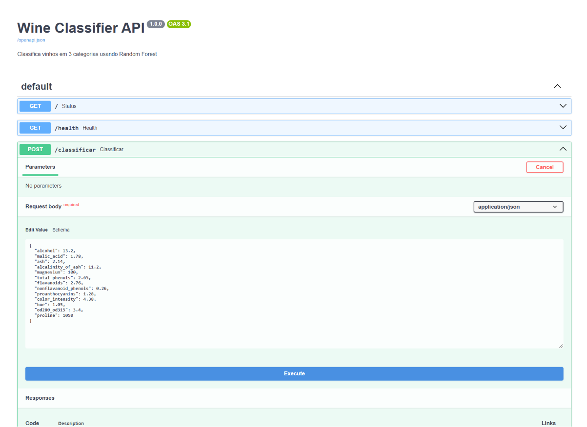
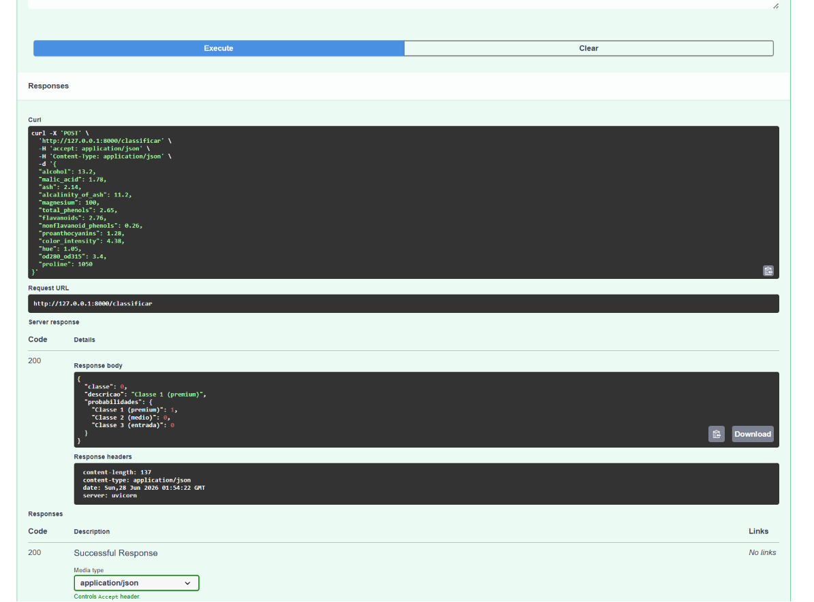

# `Wine Classifier API`

> Modelo de classificacao de vinhos containerizado com Docker, servido via FastAPI e com pipeline de CI/CD via GitHub Actions.

---

## `Tecnologias`


---

## `O que faz`

Treina um Random Forest sobre o Wine Dataset (UCI), empacota o modelo e a API dentro de um container Docker e expoe um endpoint REST para classificacao de vinhos. A cada push na branch main, o GitHub Actions executa os testes automaticamente, constroi a imagem Docker e valida que o container sobe corretamente.

---

## `Arquitetura`

```
src/treinar.py
    RandomForest + StandardScaler + feature engineering
        modelo.pkl / scaler.pkl / colunas.pkl
            src/api.py (FastAPI)
                Dockerfile
                    docker-compose.yml
                        container rodando na porta 8000

.github/workflows/ci.yml
    push na main
        instala deps
        treina modelo
        roda pytest (5 testes)
        build docker
        valida /health
```

---

## `Endpoints`

| `Metodo` | `Rota` | `Descricao` |
|---|---|---|
| GET | `/` | status da API |
| GET | `/health` | healthcheck para monitoramento |
| POST | `/classificar` | recebe dados do vinho e retorna a classe |

**Exemplo de requisicao:**

```json
POST /classificar
{
  "alcohol": 13.2,
  "malic_acid": 1.78,
  "ash": 2.14,
  "alcalinity_of_ash": 11.2,
  "magnesium": 100.0,
  "total_phenols": 2.65,
  "flavanoids": 2.76,
  "nonflavanoid_phenols": 0.26,
  "proanthocyanins": 1.28,
  "color_intensity": 4.38,
  "hue": 1.05,
  "od280_od315": 3.40,
  "proline": 1050.0
}
```

**Resposta:**

```json
{
  "classe": 0,
  "descricao": "Classe 1 (premium)",
  "probabilidades": {
    "Classe 1 (premium)": 0.8,
    "Classe 2 (medio)": 0.18,
    "Classe 3 (entrada)": 0.02
  }
}
```

---

## `Testes`

5 testes automatizados cobrindo status, health, predicao valida, soma das probabilidades e rejeicao de entrada invalida.

```bash
pytest tests/ -v
```

---

## `Pré-requisitos`

- Python 3.10+
- Docker Desktop instalado e rodando

---

## `Instalacao e uso local (sem Docker)`

```bash
git clone https://github.com/Arthur-Baptista-dos-Santos/wine_api_docker.git
cd wine_api_docker

python -m venv .venv
.venv\Scripts\activate

pip install -r requirements.txt
pip install pytest httpx

python src/treinar.py
uvicorn src.api:app --reload
```

Acesse `http://127.0.0.1:8000/docs` para a documentacao interativa (Swagger UI).

---

## `Uso com Docker`

```bash
# construir a imagem e subir o container
docker compose up --build

# testar o endpoint
curl http://localhost:8000/health
```

---

## `Estrutura`

```
wine_api_docker/
├── .github/
│   └── workflows/
│       └── ci.yml           # pipeline CI/CD automatico
├── src/
│   ├── treinar.py           # treina e salva os artefatos
│   └── api.py               # API REST com FastAPI
├── tests/
│   └── test_api.py          # 5 testes automatizados
├── docs/
│   └── screenshots/         # capturas do Swagger UI
├── modelo/                  # artefatos gerados localmente (gitignored)
├── Dockerfile               # receita para montar a imagem
├── docker-compose.yml       # orquestra o container
├── pyproject.toml           # configuracao do pytest
├── requirements.txt
├── .gitignore
└── README.md
```

---

## `Conceitos aplicados`

- **`Docker`**: empacota codigo + ambiente em uma imagem reproduzivel em qualquer maquina
- **`Dockerfile`**: receita de construcao da imagem, com cache de camadas para builds rapidos
- **`docker-compose`**: orquestra containers com configuracao declarativa, healthcheck e restart policy
- **`CI/CD`**: pipeline automatico que testa, constroi e valida a imagem a cada push
- **`GitHub Actions`**: executa o pipeline em maquinas virtuais do GitHub sem configuracao de servidor
- **`pytest`**: framework de testes que valida comportamento da API antes de qualquer deploy
- **`healthcheck`**: endpoint dedicado para monitoramento, padrao em qualquer servico em producao
- **`FastAPI`**: framework async com validacao automatica, documentacao Swagger e tipagem via Pydantic

---

## `Demonstração`

**Swagger UI, requisição**: endpoint `POST /classificar` com os 13 parâmetros químicos do vinho preenchidos.



---

**Swagger UI, resposta `200`**: modelo classifica como `"Classe 1 (premium)"` com 100% de confiança e exibe as probabilidades por classe.



---

## `Licença`

Distribuído sob a licença MIT. Veja [LICENSE](LICENSE) para mais informações.

---

## `Autor`

**Arthur Baptista dos Santos**
RM 565346 · Inteligência Artificial · FIAP 2025-2026

[](https://linkedin.com/in/arthur-baptista-dos-santos)
[](https://github.com/Arthur-Baptista-dos-Santos)
